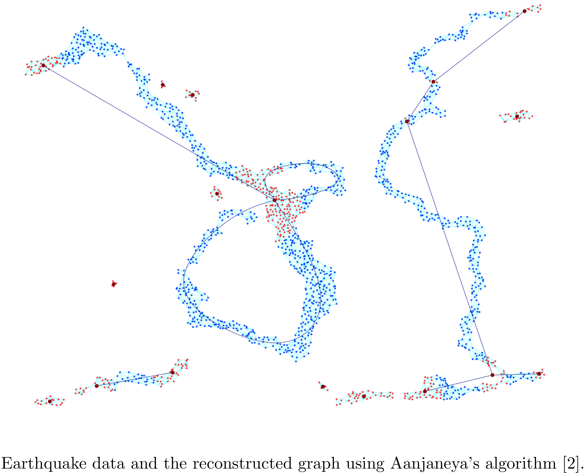

# Metric Graph Reconstruction

**Reconstructing the topology of a metric graph for representing intersecting or branching filamentary paths embedded in 2 or higher dimensional spaces**



## Introduction

This repository currently contains only the source code for the implementation of Aanjaneya's metric graph reconstruction algorithm for 2 dimensional Euclidean space.

## Toy example

In Figure 1 is an example of metric graph reconstruction of the drawing of number 7.


The input to the algorithm is the sample of points, shown in blue and red. In this example, this set of points represents the number 7 with added Gaussian noise. The reconstruction is in the form of a graph shown in black. In this example the reconstruction captures perfectly all the topological features: the relationship between the edges and vertices, the number of branching points and the degree of each node.


## Description

The main idea is the construction of a Rips-Vietoris graph of parameter `delta` around each sample point whose vertices are in the shell between radius `r` and `r + delta`, shown in red in Figure 2.


The center sample point is then labeled as an **edge point** if there are 2 connected components in the Rips-Vietoris graph and **vertex point** otherwise. Points that were labeled as vertex points are shown in red and points that were labeled as vertex points are shown in blue in Figure 1.

For more see the notebook in source directory. To see the labeling steps (e.g. 13) of the algorithm, we can call:

```python
draw_labeling(point_list, delta, r, p11, step=13)
```

The reconstruction can be incorrect if the sample is not dense enough or when choosing the wrong values for input parameters `delta`, `r`, `p11`. An example of incorrect reconstruction is in Figure 3 below, where the right edge is missing from the reconstructed graph in black.


See [1] for the explanation of how dense a sample has to be in order to guarantee a correct reconstruction of a metric graph.


## References
[1]: F. Lecci, A. Rinaldo, L. Wasserman, "Statistical Analysis of Metric Graph Reconstruction", Journal of Machine Learning Research, 2014.
[https://jmlr.csail.mit.edu/papers/volume15/lecci14a/lecci14a.pdf](https://jmlr.csail.mit.edu/papers/volume15/lecci14a/lecci14a.pdf)

[2]: M. Aanjaneya, F. Chazal, D. Chen, M. Glisse, L.J. Guibas, and D. Morozov, "Metric Graph Reconstruction from Noisy Data", Proceedings of the twenty-seventh annual symposium on Computational geometry, 2011.
[http://physbam.stanford.edu/~aanjneya/mridul_files/papers/metric.pdf](http://physbam.stanford.edu/~aanjneya/mridul_files/papers/metric.pdf)
